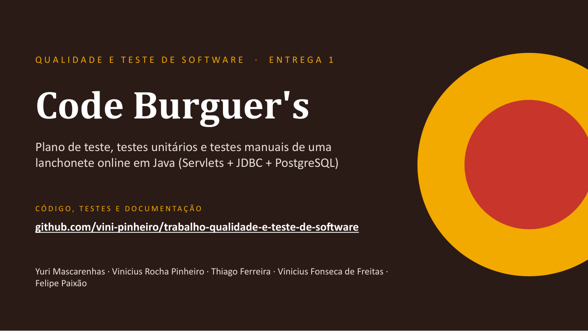
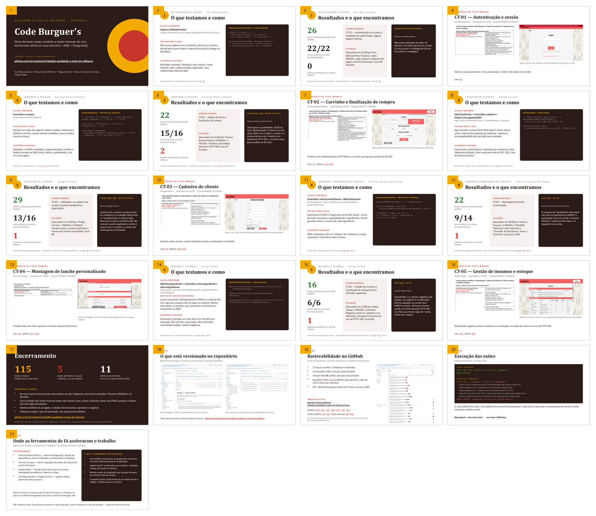

# Trabalho da matéria de Qualidade e Teste de Software baseado no projeto APS-04-Lanchonete-Online-em-Java

## Entrega 1 — apresentação

[](docs/entrega-1/apresentacao/apresentacao-entrega-1.pptx)

Vinte e um slides: abertura, três por integrante — o que testamos, os resultados e a evidência do caso manual, com o documento e a tela do sistema —, encerramento e quatro anexos finais: estrutura do repositório, issues, a saída real do Maven e os registros de uso de IA.



- [Baixar a apresentação (.pptx)](docs/entrega-1/apresentacao/apresentacao-entrega-1.pptx)
- [Roteiro de falas (.pdf)](docs/entrega-1/apresentacao/roteiro-apresentacao.pdf) — formato teleprompter, uma página por integrante
- [Relatório da Entrega 1](docs/entrega-1/README.md) — comandos, resultados, cobertura e defeitos
- [Casos de teste manuais](docs/entrega-1/casos-manuais) — um por integrante, com prints da execução
- [Evidências dos anexos](docs/entrega-1/apresentacao/anexos) — capturas do GitHub, dos documentos e da execução dos testes

### Resultado

| | |
|---|---|
| Testes unitários | 115 executados, 115 passaram (`mvn clean test`) |
| Suíte de defeitos conhecidos | 5 testes vermelhos, um por defeito aberto (`mvn test -Pdefeitos`) |
| Casos manuais | 5 executados, um por integrante: 23 passos PASSOU e 13 FALHOU |
| Defeitos | 11 encontrados, 6 já com issue aberta (#20 a #25) |

### Quem fez o quê

| Integrante | Módulo | Classe sob teste | Caso manual |
|---|---|---|---|
| Yuri Mascarenhas | Autenticação e sessão | `Helpers.ValidadorCookie` | CT-01 |
| Vinicius Rocha Pinheiro | Carrinho, pedidos e checkout | `Controllers.comprar` | CT-02 |
| Thiago Ferreira | Gestão de clientes e endereços | `DAO.DaoCliente`, `Controllers.cadastro`, `Helpers.EncryptadorMD5` | CT-03 |
| Vinicius Fonseca de Freitas | Cardápio e montagem de lanches | `Controllers.salvarLancheCliente`, `DAO.DaoLanche` | CT-04 |
| Felipe Paixão | Estoque e insumos | `DAO.DaoIngrediente`, servlets de insumo | CT-05 |

### Rodar os testes

```bash
mvn clean test
```

Sem Java instalado, o mesmo comando dentro de um contêiner:

```bash
docker run --rm -v "$PWD":/app -w /app maven:3.8.4-openjdk-8 mvn -B clean test
```

## Documentos

- [Plano de Testes](https://docs.google.com/document/d/1MT2I238OlATRWofvbea8ut1F0oSDA92Siztl87TmjpI/edit?usp=drive_link)
- Casos de Testes:
  - [Caso de Teste 1 - Yuri](docs/entrega-1/casos-de-testes/CT-01-Autenticacao-Yuri-Mascarenhas.docx)
  - [Caso de Teste 2 - Vinicius Pinheiro](docs/entrega-1/casos-de-testes/CT-02-Carrinho-e-Compra-Vinicius-Rocha-Pinheiro.docx)
  - [Caso de Teste 3 - Thiago](docs/entrega-1/casos-de-testes/CT-03-Cadastro-de-Cliente-Thiago-Ferreira.docx)
  - [Caso de Teste 4 - Vinicius Fonseca](docs/entrega-1/casos-de-testes/CT-04-Montagem-de-Lanche-Vinicius-Fonseca.docx)
  - [Caso de Teste 5 - Felipe](docs/entrega-1/casos-de-testes/CT-05-Insumos-e-Estoque-Felipe-Paixao.docx)

## Sobre

Com o objetivo de desenvolver a capacidade dos alunos e obter nota na disciplina APS (Atividades Práticas Supervisionadas),
foi proposto um projeto de desenvolvimento de um sistema para uma lanchonete online, onde o administrador consiga controlar
os pedidos da lanchonete e emitir relatórios. A lanchonete devera permitir o cadastro dos usuários, para que eles possam realizar seus pedidos,
e o cadastro de produtos, que ficariam por parte do administrador. Após o cadastro, cliente poderá utilizar os ingredientes cadastrados para
criar seu lanche personalizado. O sistema deverá fazer o controle dos pedidos de forma que agrade os clientes, e controlar tambem o estoque de produtos.

## Tecnologias Utilizadas

O Sistema funciona com base em um Frontend Utilizando HTML 5, CSS3 e JavaScript, e um Backend baseado em Java Web utilizando-se do Servidor Glassfish 4
e muito baseado no uso de Servlets para a Comunicação atraves de requisições. Além disso o Sistema utiliza das Bibliotecas gson-2.8.6 e json-20200518
Para a manipulação de Arquivos JSON dentro do Código Java, e de um Banco de Dados PostgreSQL, do qual o Código base também se encontra no repositório.

## Alguns Screenshots


## Como rodar o projeto

### Pré-requisitos

- [Docker](https://www.docker.com/get-started) e [Docker Compose](https://docs.docker.com/compose/install/)
- [Java 8+](https://adoptopenjdk.net/) e [Maven](https://maven.apache.org/)

### Passos para executar

1. **Clone o repositório:**

   ```bash
   git clone <url-do-repositorio>
   cd APS-04-Lanchonete-Online-em-Java
   ```

2. **Suba os containers com Docker Compose:**

   ```bash
   docker-compose up --build -d
   ```

   Isso irá criar e iniciar os containers do banco de dados PostgreSQL e do servidor Tomcat com a aplicação.

3. **Acesse a aplicação:**
   - API: [http://localhost:8080](http://localhost:8080)

4. **Para parar e remover tudo:**

   ```bash
   docker-compose down -v
   ```

### Observações

- O banco de dados será inicializado automaticamente com as tabelas necessárias e o usuário de admin para login.
- Caso precise alterar configurações, edite os arquivos `docker-compose.yml` ou `banco.sql`.
- Se houver problemas de cache no navegador, utilize Ctrl+F5 ou limpe o cache manualmente.
